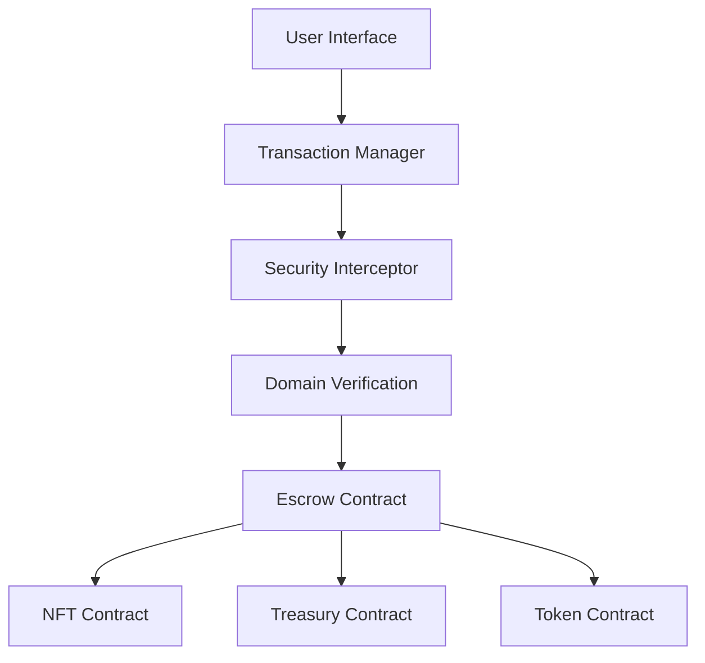
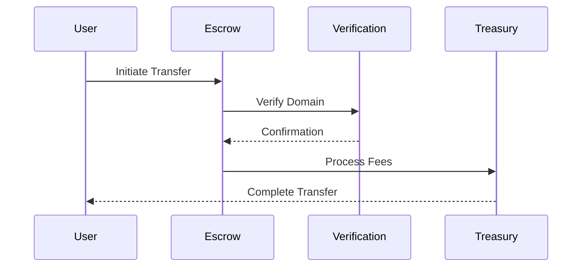

# DomainChain: Decentralized Domain Name Escrow and Trading Platform
### Technical Whitepaper v1.0

## Abstract

DomainChain is a decentralized platform for secure domain name trading and transfer, built on the Ethereum blockchain. The platform combines NFT technology, multi-signature escrow, and real-time domain verification to create a trustless environment for domain name transactions. This document outlines the technical architecture, security features, and token economics of the DomainChain platform.

## Table of Contents
1. Introduction
2. System Architecture
3. Smart Contract Components
4. Security Features
5. Token Economics
6. Technical Implementation
7. Risk Analysis

## 1. Introduction

Domain name trading traditionally relies on centralized intermediaries and manual verification processes, leading to delays, high costs, and potential security risks. DomainChain addresses these challenges by providing:

- Instant domain transfers with cryptographic verification
- Automated escrow services with smart contract security
- NFT representation of domain ownership
- Token-based incentives for participants
- Multi-layer security checks

## 2. System Architecture

### 2.1 Core Components

1. **Domain NFT System**
   - ERC-721 compliant tokens representing domain ownership
   - On-chain metadata storage
   - Dynamic pricing mechanism
   - Domain verification integration

2. **Escrow System**
   - Multi-signature transaction support
   - Automated fund distribution
   - Instant transfer capabilities
   - Dispute resolution mechanism

3. **Treasury System**
   - Fee collection and distribution
   - Platform revenue management
   - Provider fund allocation
   - Security deposit handling

4. **Token System**
   - ERC-20 reward token (DCH)
   - Incentive distribution
   - Governance capabilities
   - Staking mechanisms

### 2.2 Integration Layer

- Domain Verification Oracle
- Security Interceptor
- Transaction Processing Pipeline
- External API Interfaces

## 3. Smart Contract Components

### 3.1 InstantDomainNFT Contract
```solidity
struct DomainMetadata {
    string domainName;
    address originalOwner;
    uint256 createdAt;
    uint256 price;
    bytes32 verificationHash;
}
```

### 3.2 DomainChainTreasury Contract
- Base verification fee: 0.001 ETH
- Platform fee: 2.5%
- Provider fund management
- Fee distribution system

### 3.3 ImprovedDomainEscrow Contract
- Transaction validity period: 15 minutes
- Multi-signature verification
- Meta-transaction support
- Automated settlement

### 3.4 DomainChainToken Contract
- Total supply: 100,000,000 DCH
- Base reward: 0.05%
- Dynamic multiplier system
- Governance features

## 4. Security Features

### 4.1 Transaction Security
- Multi-signature verification
- Time-bound transactions
- Replay attack protection
- Reentrancy guards

### 4.2 Domain Verification
Three-layer verification system:
1. DNS root server verification
2. Registrar API verification
3. Blockchain oracle verification

### 4.3 Risk Assessment
Real-time risk scoring based on:
- User reputation
- Transaction patterns
- Geographic analysis
- Device integrity

## 5. Token Economics

### 5.1 Token Distribution
- Initial supply: 1,000,000 DCH
- Maximum supply: 100,000,000 DCH
- Treasury allocation: 20%
- Development fund: 15%
- Community rewards: 65%

### 5.2 Reward System
- Base reward rate: 0.05%
- Dynamic multiplier: 1x-5x
- Staking rewards
- Transaction incentives

### 5.3 Fee Structure
- Base verification: 0.001 ETH
- Platform fee: 2.5%
- Provider rewards: Variable
- Staking returns: APY-based

## 6. Technical Implementation

### 6.1 Smart Contract Architecture


### 6.2 Verification Flow


## 7. Risk Analysis

### 7.1 Smart Contract Risks
- Reentrancy attacks
- Front-running
- Integer overflow/underflow
- Gas limitations

### 7.2 Operational Risks
- Oracle failures
- Network congestion
- API downtime
- Verification delays

### 7.3 Mitigation Strategies
- Comprehensive testing
- Security audits
- Rate limiting
- Fallback mechanisms

## Technical Schema

### Domain NFT Schema
```typescript
interface DomainNFT {
    tokenId: number;
    domainName: string;
    originalOwner: address;
    currentOwner: address;
    createdAt: timestamp;
    price: bigint;
    verificationHash: bytes32;
    metadata: {
        registrationStatus: string;
        expiryDate: timestamp;
        transferHistory: Transfer[];
    }
}
```

### Transaction Schema
```typescript
interface DomainTransaction {
    transactionId: bytes32;
    domainId: number;
    seller: address;
    buyer: address;
    price: bigint;
    status: TransactionStatus;
    signatures: {
        seller: bytes;
        buyer: bytes;
    };
    verification: {
        proof: bytes32;
        timestamp: number;
        sources: string[];
    }
}
```

### Security Schema
```typescript
interface SecurityProfile {
    userId: address;
    reputationScore: number;
    riskLevel: RiskLevel;
    transactionVolume: bigint;
    verificationStatus: VerificationStatus;
    deviceSignatures: string[];
    geographicData: GeoLocation;
}
```

## Conclusion

DomainChain represents a significant advancement in decentralized domain name trading, combining robust security measures with efficient transaction processing. The platform's architecture ensures trustless operations while maintaining high security standards and user incentives.